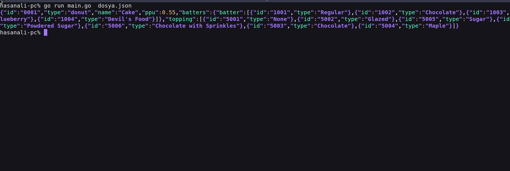

     Kullanımı:
        json_view [<flags>] [DOSYA]  #Json dosyası içeriğini çıktı olarak almayı sağlar.
        Örnek: json_view dosya.json
         cat dosya.json | json_view  # Json dosyasını içeriğini görmek için .
     Flags:
         -h, --yardım : Yardım komutlarını gösterir.

